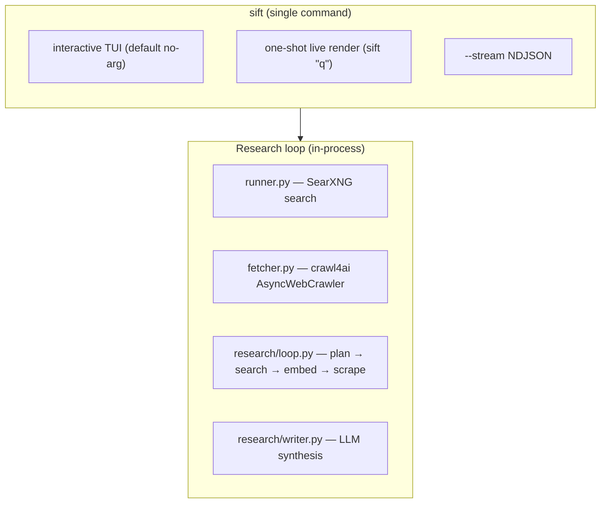

# sift — in-process web research CLI

## What it is

`sift` is a **single-command CLI** that runs a [Vane-style](https://github.com/theckman/vane)
multi-step research loop entirely in-process — no server, no port, no Docker.

It uses [SearXNG](https://github.com/searxng/searxng) for searches and
[crawl4ai](https://github.com/unclecode/crawl4ai) for page reads, then synthesizes a
cited answer via an OpenAI-compatible LLM.

## Quick start

```sh
# Interactive research with follow-up REPL
sift

# One-shot research (live TUI output, then exit)
sift "what is HTTP/3"

# One-shot research + write answer to file
sift -o ANSWER.md "what is HTTP/3"

# Stream NDJSON events for programmatic use
sift --stream "HTTP/3 benefits"

# Quality mode with domain filter
sift --mode quality --allow wikipedia.org "explain the CFS scheduler"
```

## Command interface

```
Usage: sift [OPTIONS] [QUERY]

  Research the web: plan → search → synthesize.
```

There are **no subcommands**. All options are research options:

| Flag | Default | Env var | Notes |
|------|---------|---------|-------|
| `QUERY` (positional) | (prompt if omitted) | — | Research question |
| `--mode {speed,balanced,quality}` | `balanced` | — | Research depth |
| `--stream` | off | — | NDJSON events to stdout |
| `-o / --output PATH` | (none) | — | Write synthesis to markdown file |
| `--llm-host URL` | — | `SIFT_LLM_HOST` | OpenAI-compatible base URL |
| `--llm-apikey KEY` | — | `SIFT_LLM_APIKEY` | Use `-` for local endpoints |
| `--llm-model NAME` | — | `SIFT_LLM_MODEL` | Model identifier |
| `--embed-base-url URL` | — | `SIFT_EMBED_BASE_URL` | Embedding endpoint |
| `--embed-api-key KEY` | — | `SIFT_EMBED_API_KEY` | — |
| `--embed-model NAME` | — | `SIFT_EMBED_MODEL` | Embedding model |
| `--system STR` | (none) | — | System instructions for the writer |
| `--history-file PATH` | (none) | — | JSON `[[role, text], ...]` |
| `--lang` | `all` | — | Search language |
| `--safesearch 0-2` | `0` | — | Safe search level |
| `--allow DOMAIN` | (none) | — | Repeatable domain allow filter |
| `--block DOMAIN` | (none) | — | Repeatable domain block filter |
| `--log-file PATH` | default | — | Rotating log file |
| `--verbose` | off | — | Raise log level to DEBUG |
| `--settings PATH` | bundled | — | Override settings.yml |

## Invocation forms

| Invocation | Behavior |
|------------|----------|
| `sift` | Prompt for question, run live TUI + follow-up REPL |
| `sift "q"` | Live TUI once, then exit |
| `sift -o file.md "q"` | Live TUI once, write markdown to file, exit |
| `sift -o file.md` | **Error**: question required when `-o` is given |
| `sift --stream "q"` | NDJSON events to stdout, then exit |

## Architecture



Key architectural principles:
- **No server, no port, no Redis** — everything runs in-process
- **Single command** — no subcommands; all options are research options
- **SearXNG** for search, **crawl4ai** for page reads
- **Lazy imports** — `openai`, `crawl4ai`, `searx` imported only when needed

## Exit codes

| Code | Meaning |
|------|---------|
| `0` | Success |
| `1` | No synthesis produced |
| `2` | Bad invocation (missing question with `-o`, unknown mode, LLM/embed not configured) |

## Reference files

- **[references/commands.md](references/commands.md)** — Full option reference with examples
- **[references/schemas.md](references/schemas.md)** — NDJSON event schema and `-o` output format
- **[references/research-loop.md](references/research-loop.md)** — Research loop architecture
- **[references/install.md](references/install.md)** — Installation and environment variables
