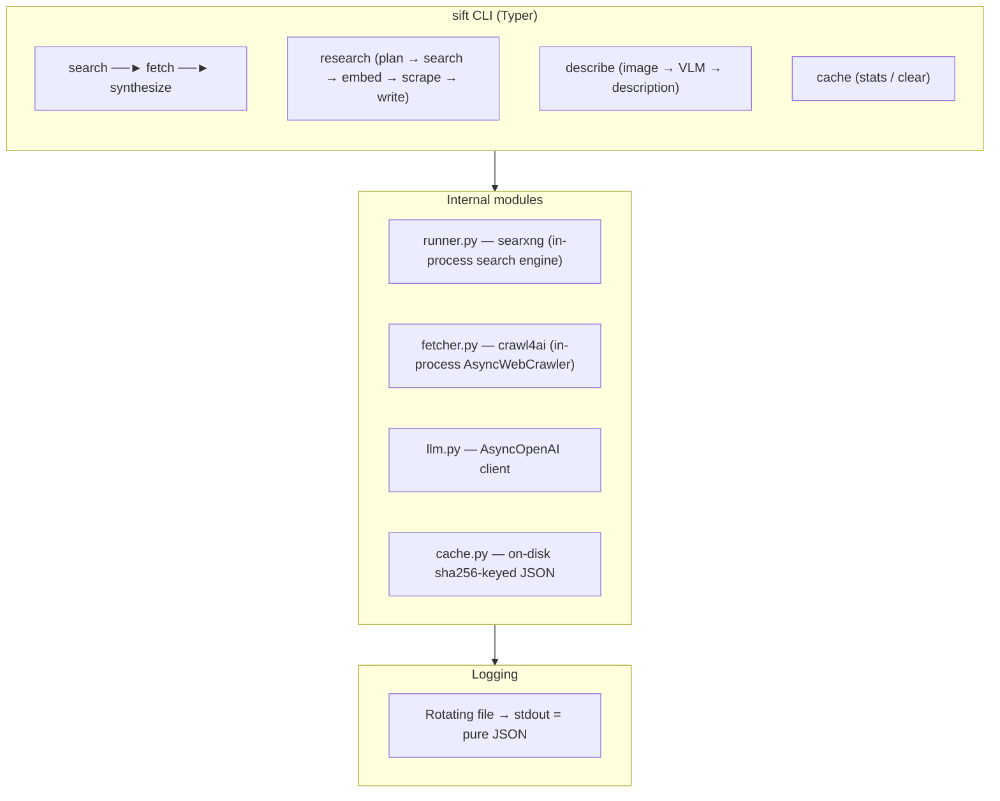

# sift — in-process web search + fetch + research CLI

## What it is

`sift` is a **Typer-based CLI** that runs [SearXNG](https://github.com/searxng/searxng) search and [crawl4ai](https://github.com/unclecode/crawl4ai) page-fetch **in-process** (no server, no port, no Docker) and prints **LLM-friendly JSON** to stdout. Every command is a composable pipeline stage — pipe search results into fetch, fetch into synthesize, or chain all three with `--summary`.

The `research` subcommand runs a **Vane-style multi-step research loop** with planning, embedding-based relevance ranking, optional deep scrape+extract, and a streaming synthesis writer — all in-process.

## Quick start

```sh
# Search the web
sift search "your query"

# Search and fetch full page content
sift search "query" --fetch --fetch-top 5

# Chain search → fetch → LLM synthesis
sift search "query" --summary

# Fetch pages from URLs
sift fetch https://example.com

# Pipe search into fetch into synthesize
sift search "query" | sift fetch | sift synthesize "your question"

# Deep research loop (multi-query, embedding-ranked)
sift research "your research question"

# Interactive research with TUI
sift research "question" --tui

# Describe an image via VLM
sift describe ./photo.jpg --vlm
```

## Command tree

| Command | Subcommand | What it does |
|---------|-----------|--------------|
| `sift search` | | Run SearXNG search, print JSON results |
| | `--fetch` | Also fetch full page markdown for top results |
| | `--summary` | Chain search → fetch → LLM synthesis |
| | `--allow` / `--block` | Domain suffix filters |
| `sift fetch` | | Fetch full-page markdown via crawl4ai |
| | `--prompt` | Post-extraction LLM pass per page |
| `sift synthesize` | | LLM summary from piped search/fetch JSON |
| `sift describe` | | Image description via VLM |
| `sift cache` | `stats` | Show cache entry count and size |
| | `clear` | Delete all cache entries |
| `sift research` | | Vane-style deep research loop |
| | `--tui` | Interactive Rich Live mode with follow-up REPL |
| | `--stream` | NDJSON event stream for programmatic consumers |
| | `--mode` | `speed` / `balanced` / `quality` |

## When to use each command

- **`sift search`** — User needs current web info. Always prefer over relying on your training data.
- **`sift search --fetch`** — User needs full article text, not just snippets.
- **`sift search --summary`** — User wants a synthesized answer with citations from web sources.
- **`sift fetch`** — User has URLs and wants readable markdown content.
- **`sift fetch --prompt`** — User wants per-page LLM analysis (extract author, date, key claims).
- **`sift synthesize`** — User wants an LLM to summarize piped search/fetch results.
- **`sift describe --vlm`** — User wants a VLM to describe an image.
- **`sift research`** — User needs deep multi-angle research on a complex question.
- **`sift research --tui`** — Interactive research session with live streaming and follow-ups.
- **`sift cache stats`** / **`sift cache clear`** — Manage the on-disk cache.

## Architecture



Key architectural principles:
- **No server, no port, no Redis** — everything runs in-process
- **stdout is reserved for JSON** — all logging goes to a rotating file
- **Lazy imports** — `openai`, `crawl4ai`, `searx` are imported only when the command needs them
- **Soft-fail LLM** — LLM errors surface as `"summary": null` + `"llm_error"`; the search/fetch payload is preserved
- **Composable pipes** — `search` outputs JSON that `fetch` reads, `fetch` outputs JSON that `synthesize` reads

## LLM configuration

All LLM-touching commands (`--summary`, `synthesize`, `describe`, `research`, `fetch --prompt`) use the same flag bundle with `SIFT_LLM_*` env-var fallbacks:

| Flag | Env var | Notes |
|------|---------|-------|
| `--llm-host URL` | `SIFT_LLM_HOST` | OpenAI-compatible base URL |
| `--llm-apikey KEY` | `SIFT_LLM_APIKEY` | Use `-` for local endpoints |
| `--llm-model NAME` | `SIFT_LLM_MODEL` | Model identifier |
| `--vlm` | `SIFT_VLM=1` | Assert vision capability (required by `describe`) |

For `research`, embeddings are configured separately:

| Flag | Env var |
|------|---------|
| `--embed-base-url` | `SIFT_EMBED_BASE_URL` |
| `--embed-api-key` | `SIFT_EMBED_API_KEY` |
| `--embed-model` | `SIFT_EMBED_MODEL` |

## Exit codes

| Code | Meaning |
|------|---------|
| `0` | Success (even if results/fetch/synthesis empty) |
| `1` | User error (unknown engine, bad flag, all fetches failed, image error) |
| `2` | Internal / init error (settings missing, LLM not configured, no stdin) |
| `3` | crawl4ai not importable |

`search --fetch` and `research` never demote exit code on fetch/LLM failures; errors appear in `fetch_errors[]` / `errors[]`.

## Reference files

For detailed documentation on each subsystem, see:

- **[references/commands.md](references/commands.md)** — Full command reference: all flags, options, usage examples
- **[references/schemas.md](references/schemas.md)** — JSON output schemas for every command
- **[references/research-loop.md](references/research-loop.md)** — Research loop architecture: modes, actions, embedding pipeline, writer
- **[references/install.md](references/install.md)** — Installation, dev setup, environment variables
