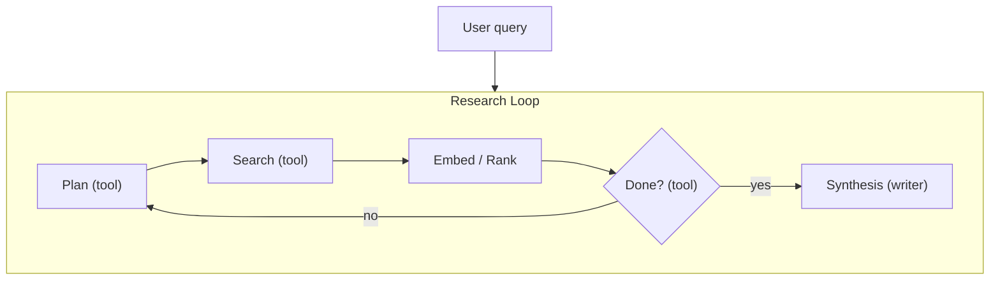

# sift research loop — architecture

## Overview

The `sift research` subcommand runs a **Vane-style iterative research loop** entirely in-process. It combines planning, web search, embedding-based relevance ranking, deep scraping with LLM extraction (quality mode), and a streaming synthesis writer.



## Components

### 1. Loop (`research/loop.py`)

The `run()` function drives an OpenAI tool-calling chat until `done` is called or max iterations are reached.

**Message loop:**
1. Build system prompt from mode-specific researcher prompt + action descriptions
2. Call LLM with tool schemas
3. Execute all returned tool calls
4. Append tool results to message history
5. Repeat until `done` or max iterations

**Returns:** `ResearcherResult` with `actions[]`, `sources[]` (deduped by URL), `usage{}`.

### 2. Action registry (`research/actions.py`)

Four actions, registered as OpenAI function tools:

| Action | Purpose | Available in |
|--------|---------|-------------|
| `plan` | State reasoning in natural language before acting | balanced, quality (not speed) |
| `search` | Run 1-3 web queries via SearXNG | all modes |
| `scrape_url` | Fetch specific URLs user asked about | all modes |
| `done` | Terminate the loop | all modes |

### 3. Search behavior by mode

**Speed mode:**
- No `plan` action available
- Runs queries directly via SearXNG
- Embeds snippets, scores by cosine similarity to query, filters < 0.5, dedupes > 0.75 similarity
- Returns top 20

**Balanced mode:**
- Same as speed but with `plan` action available
- Slightly more permissive about multiple search rounds

**Quality mode:**
- Runs queries via SearXNG
- Calls an **LLM picker** to select 2-3 best results from each batch
- **Scrapes** selected URLs via crawl4ai
- **Chunks** scraped content (4000 chars, 500 overlap)
- Runs **LLM extractor** on each chunk to extract facts relevant to the query
- Accumulates extracted facts as the result content

### 4. Embedding pipeline

Used in speed and balanced modes for snippet ranking:

1. Embed query + all snippet texts via `embeddings.embed_text()`
2. Compute cosine similarity between query vector and each snippet vector
3. Filter: keep only results with similarity > 0.5
4. Sort by similarity descending
5. Dedupe: if two results have similarity > 0.75 between their vectors, keep the higher-scored one
6. Return top 20

### 5. Source deduplication

After the loop finishes, all `search_results` actions are aggregated:
- Dedupe by URL (first occurrence wins, but content is concatenated if different)
- Keep max similarity score
- Sort by similarity descending

### 6. Writer (`research/writer.py`)

The writer generates the final synthesis:

1. Format sources as `[N] Title (url)\ncontent`
2. Build writer system prompt with context, system instructions, mode-specific quality addendum
3. Stream LLM response via `AsyncOpenAI` with `stream=True`
4. Emit `response` events for each delta
5. On streaming failure, fall back to non-streaming request

**Citation format:** The writer prompt instructs the LLM to use `[1]`, `[2]`, etc. inline citations matching the source order.

### 7. Event bus (`research/events.py`)

`EventBus` is an async `asyncio.Queue`-based pub/sub:

- `emit(Event)` — safe to call from any task
- `iterate()` — async generator that yields until `close()`
- `close()` — sends sentinel to all consumers

Event types: `init`, `plan`, `search`, `search_results`, `reading`, `extracted`, `response`, `sources`, `done`, `error`

### 8. Output modes

| Mode | What happens |
|------|-------------|
| **JSON** | Collects all events, builds a single JSON object with `actions[]`, `sources[]`, `synthesis`, `usage`, `errors[]` |
| **Stream** | Each event is printed as a JSON line immediately |
| **TUI** | Rich Live display with action log panel + live markdown rendering, then follow-up REPL |

### 9. TUI (`research/tui.py`)

The TUI mode uses Rich's `Live` display:
- **Top panel:** Action log (last 12 entries) showing plan, search, results, reading, extracted, errors
- **Bottom panel:** Live-updating Markdown rendering of the synthesis
- After research completes, drops into a Python `input()` loop for follow-up questions
- Follow-ups re-run the entire research loop with conversation history

## File reference

```
src/sift/research/
├── __init__.py          # Package marker
├── loop.py              # Main research loop (run function)
├── actions.py           # Action registry (plan/search/scrape_url/done)
├── prompts.py           # System prompts for researcher, writer, picker, extractor
├── embeddings.py        # OpenAI-compatible embeddings client
├── embed_config.py      # EmbedConfig dataclass + env-var resolution
├── utils.py             # cosine_similarity, split_text
├── events.py            # Event types, EventBus
├── writer.py            # Streaming synthesis writer
└── tui.py               # Rich Live TUI + follow-up REPL
```

## Max iterations by mode

| Mode | Max iterations | Defined in |
|------|---------------|-----------|
| `speed` | 2 | `loop.py:MAX_ITER` |
| `balanced` | 6 | `loop.py:MAX_ITER` |
| `quality` | 25 | `loop.py:MAX_ITER` |
